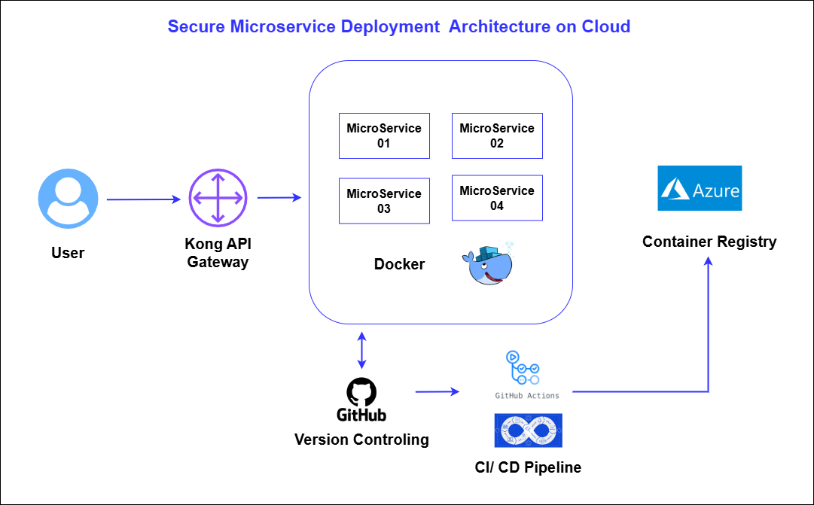

# Secure Identity Service

🚀 Cloud Auth Microservice | DevOps + Security A secure, containerized authentication API deployed on Azure with CI/CD (GitHub Actions), SAST scans, and cloud best practices. Built with Node.js/Express, Docker, and MongoDB.

## Architecture Diagram

